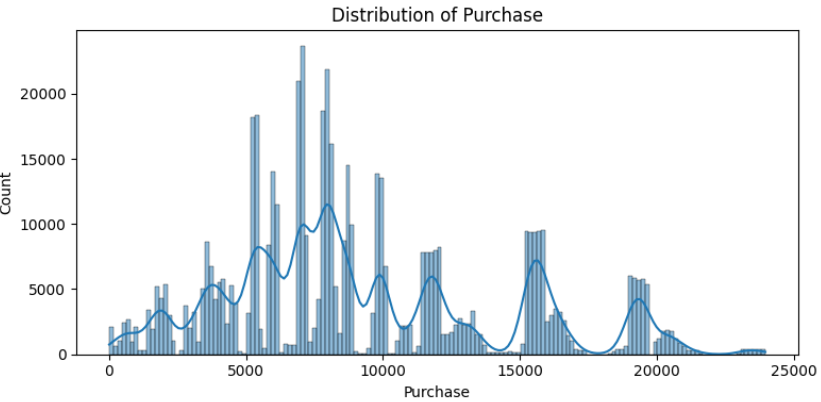
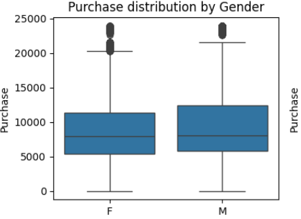
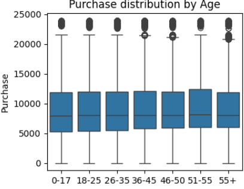
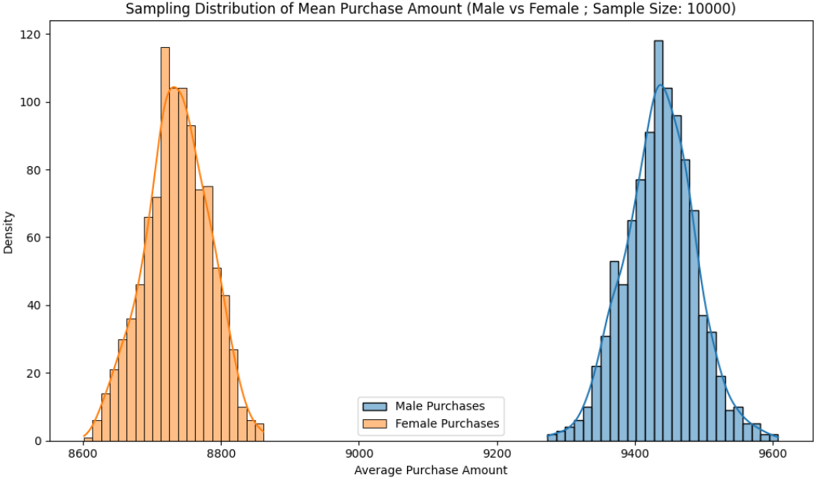

# Retail Customer Purchase Analysis

## Project Overview

This project analyzes customer purchasing behavior during a major retail sales event using transaction data. The objective is to identify spending patterns across different customer segments through Exploratory Data Analysis (EDA) and statistical techniques such as the Central Limit Theorem (CLT) and Confidence Interval Analysis.

The analysis provides data-driven insights that can support customer segmentation, targeted marketing campaigns, inventory planning, and business decision-making.

---

## Business Objective

The primary objective of this project is to:

- Understand customer purchasing behavior.
- Analyze spending patterns across demographic groups.
- Apply statistical techniques such as CLT and Confidence Intervals.
- Generate actionable business insights for retail decision-making.

---

## Dataset Description

The dataset contains customer demographic information and purchase transaction details collected during a major retail sales event.

Features include:

- Gender
- Age
- Occupation
- City Category
- Stay in Current City
- Marital Status
- Product Categories
- Purchase Amount

---

## Technologies Used

- Python
- Pandas
- NumPy
- Matplotlib
- Seaborn
- SciPy
- Statsmodels
- Google Colab

---

## Project Workflow

Dataset

↓

Data Understanding

↓

Data Cleaning

↓

Exploratory Data Analysis (EDA)

↓

Statistical Analysis

↓

Central Limit Theorem (CLT)

↓

Confidence Interval Analysis

↓

Business Insights

↓

Business Recommendations

---

## Sample Visualizations

### Purchase Distribution



---

### Gender-wise Purchase Analysis



---

### Age-wise Purchase Analysis



---

### Confidence Interval Analysis



---

## Key Business Insights

- Male customers exhibit a higher average purchase amount than female customers.
- Marital status has minimal influence on purchase amount.
- Purchase behavior is relatively consistent across age groups.
- Larger sample sizes produce narrower confidence intervals, demonstrating the Central Limit Theorem.
- Product categories contribute more to spending variation than demographic characteristics.
- Age and occupation influence purchasing behavior.
- Marital status has limited impact on purchase amounts.
- Large sample sizes improve the stability of confidence intervals.
- Statistical analysis helps estimate population spending behavior from sample data.

---

## Business Recommendations

- Develop targeted marketing campaigns for high-value customer segments.
- Develop personalized promotional campaigns based on customer purchasing behavior and demographic insights.
- Improve inventory planning using purchasing trends.
- Use statistical analysis to support business decision-making.

---

## Repository Structure

```
Retail-Customer-Purchase-Analysis
│
├── Images/
├── README.md
├── retail_customer_purchase_analysis.ipynb
├── requirements.txt
└── .gitignore
```

---

## Future Improvements

- Build predictive models for customer purchase behavior.
- Perform customer segmentation using clustering techniques.
- Develop interactive dashboards using Tableau or Power BI.

---

## Author

**Sowmya Chethi**

Aspiring Data Analyst | Python | SQL | Statistics | Data Visualization | Machine Learning
